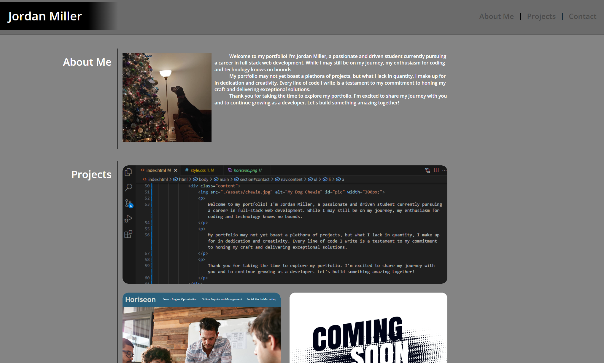

# Jordan Miller Portfolio

This repository contains the HTML and CSS files for my portfolio page.

## Files

- `index.html`: HTML file containing the structure of the portfolio page.
- `assets/reset.css`: CSS file for resetting default styles.
- `assets/style.css`: CSS file for styling the portfolio page.

## Usage

To view the portfolio page, simply open the `index.html` file in a web browser.

## About Me

This section contains information about me, including a brief introduction and a picture of my dog.

## Projects

This section showcases my projects, including descriptions and links to each project.

## Contact

This section provides contact information, including phone number, email, and GitHub profile link.

## Appearance

---

This portfolio page is designed and developed by Jordan Miller.

